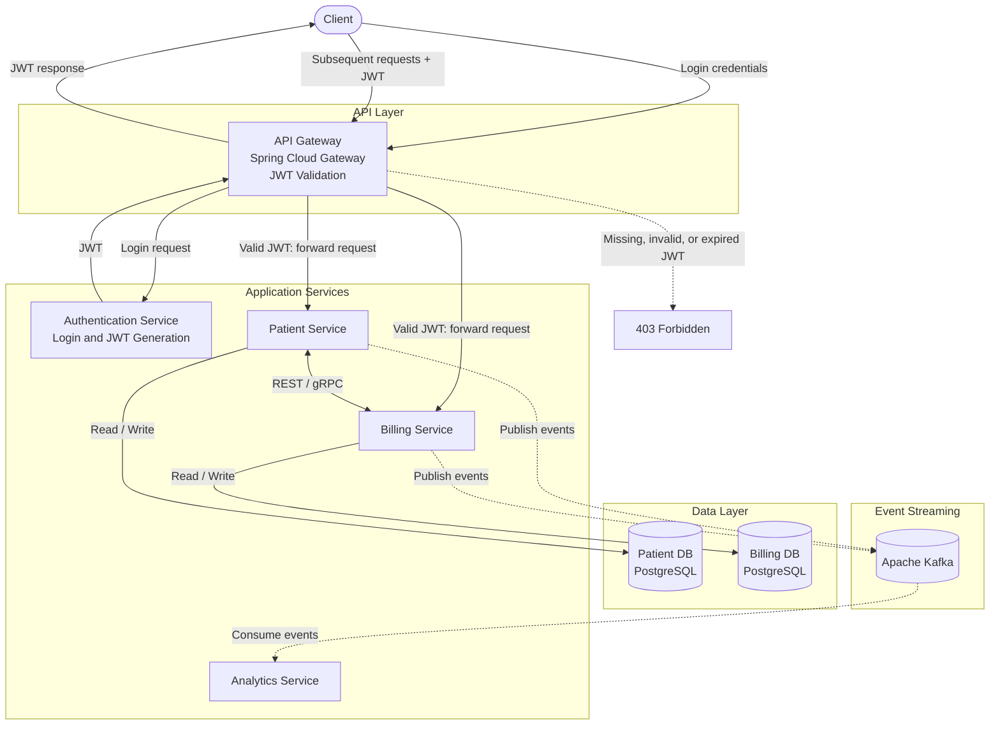

# Patient Management System

A microservices-based Patient Management System built using **Java, Spring Boot, PostgreSQL, Apache Kafka, gRPC, and Docker**. This project demonstrates microservice decomposition, inter-service communication, API gateway routing, JWT-based authentication, event-driven processing, integration testing, and containerized local development.

## Architecture

The system follows a microservices architecture, with each service responsible for a specific business capability.

### Core Components

* **API Gateway:** Acts as the single entry point for client requests. Validates JWTs on subsequent requests and routes authorized requests to the appropriate backend services.
* **Authentication Service:** Handles user login and JWT generation.
* **Patient Service:** Manages patient records and exposes REST APIs for patient-related operations.
* **Billing Service:** Handles billing-related operations and communicates with other services.
* **Analytics Service:** Consumes application events to support analytics-related functionality.
* **PostgreSQL:** Provides persistent storage for application data.
* **Apache Kafka:** Enables asynchronous, event-driven communication between services.
* **gRPC:** Enables synchronous communication between selected services using Protocol Buffers.
* **Docker:** Containerizes PostgreSQL and Kafka for local development.
* **IntelliJ IDEA:** Used to run and manage Spring Boot microservices through Run/Debug Configurations.

## High-Level Architecture

*Conceptual overview. The diagram represents the architectural roles and communication paths. Actual service connections and event flows should reflect the implemented configuration.*

## Tech Stack

| Category          | Technologies               |
| ----------------- | -------------------------- |
| Language          | Java 21                    |
| Backend           | Spring Boot                |
| API Communication | REST, gRPC                 |
| Messaging         | Apache Kafka               |
| Database          | PostgreSQL                 |
| ORM               | Spring Data JPA, Hibernate |
| API Gateway       | Spring Cloud Gateway       |
| Authentication    | JWT, Bearer Tokens         |
| Serialization     | Protocol Buffers           |
| Containerization  | Docker                     |
| IDE               | IntelliJ IDEA              |
| Build Tool        | Maven                      |
| Testing           | JUnit 5, REST Assured      |

## Key Engineering Concepts

* **Microservices Architecture:** Decomposed application functionality into independently developed services.
* **Synchronous Communication:** Used REST and gRPC for service-to-service interactions.
* **Event-Driven Architecture:** Used Kafka for asynchronous event publishing and consumption.
* **API Gateway Pattern:** Centralized request routing and gateway-level request handling.
* **JWT-Based Authentication:** Implemented login and token generation through the Authentication Service, with JWT validation at the API Gateway.
* **Request Authorization:** Rejected requests with missing, invalid, or expired JWTs at the gateway, returning `403 Forbidden`.
* **Database Integration:** Integrated PostgreSQL using Spring Data JPA and Hibernate.
* **Integration Testing:** Used JUnit 5 and REST Assured to test application behavior and REST API interactions.
* **Containerization:** Used Docker to run PostgreSQL and Kafka locally.

## Authentication Flow

1. The client submits login credentials through the API Gateway.
2. The gateway forwards the login request to the Authentication Service.
3. The Authentication Service authenticates the user and generates a JWT.
4. The JWT is returned to the client.
5. For subsequent requests, the client includes the JWT in the `Authorization` header as a Bearer token.
6. The API Gateway validates the JWT.
7. If the token is valid, the gateway forwards the request to the target backend service.
8. If the token is missing, invalid, or expired, the gateway rejects the request with `403 Forbidden`.

## Testing

The project uses JUnit 5 and REST Assured for automated testing.

* **JUnit 5:** Provides the testing framework for writing and executing test cases.
* **REST Assured:** Supports REST API testing, including HTTP request execution and response validation.
* **Integration Testing:** Tests interactions between application components and API endpoints.

## Future Improvements

* Implement centralized observability and distributed tracing.
* Expand integration and end-to-end test coverage.
* Add CI/CD pipelines for automated builds and deployment.
* Introduce resilience patterns such as retries, timeouts, and circuit breakers.
* Add Docker Compose for reproducible local environment setup.
* Explore cloud deployment and Infrastructure as Code.

## Scope

This project focuses on backend development, microservices architecture, inter-service communication, JWT-based authentication, event-driven processing, automated testing, and local containerized infrastructure.
